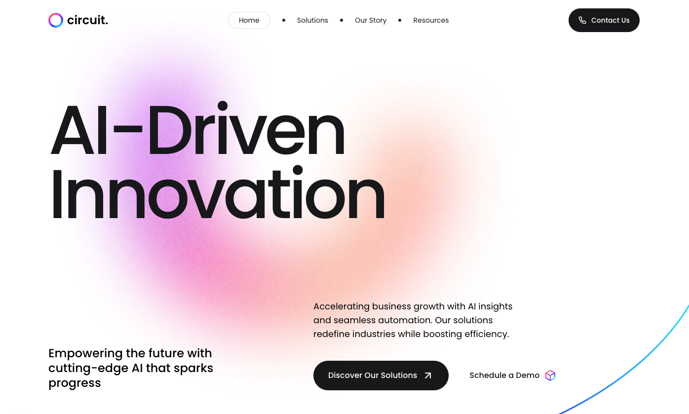

# Circuit Landing Page

## Overview

Circuit Landing Page is a modern, responsive single-page website designed to showcase an AI-driven solution. Built with Next.js and SCSS, the landing page features a dynamic hero section, an interactive carousel, comprehensive pricing plans, and a compelling call-to-action—all wrapped up in a clean, contemporary design.

---

## Screenshot



---

## Links

- **GitHub URL:** [GitHub Repository](https://github.com/jenniferokafor/circuit-landing-page)
- **Live Site URL:** [circuit-jen-portfolio-project.netlify.app](https://circuit-jen-portfolio-project.netlify.app/)

---

## Built With

- **Next.js:** For server-side rendering and a fast, scalable React framework.
- **React:** For building interactive UI components.
- **SCSS Modules:** For modular, maintainable, and responsive styling.
- **Custom Hooks:** Leveraging hooks like `useHome` for interactive functionalities.
- **Next/Image:** For optimized image rendering and performance.

---

## Installation and Setup

1. **Clone the Repository:**

   ```bash
   git clone https://github.com/yourusername/circuit-landing-page.git
   cd circuit-landing-page
   ```

2. **Install Dependencies:**

   ```bash
   npm install
   ```

3. **Run the Development Server:**

   ```bash
   npm run dev
   ```

4. **Open in Your Browser:**
   Navigate to http://localhost:3000 to view the landing page locally.
